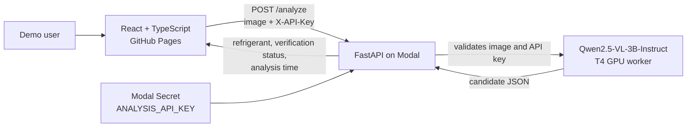

# Refrigerant Nameplate Analysis Demo

A proof-of-concept web application that reads the refrigerant designation from an air-conditioner outdoor-unit nameplate image.

The application uses **Qwen2.5-VL-3B-Instruct** directly on a Modal T4 GPU worker. It has no database, accounts, or external VLM API dependency.

## What it does

- Accepts one JPEG, PNG, or WebP nameplate image up to 10 MB.
- Requires a shared six-character API key for every analysis request.
- Returns the refrigerant type when the model reads one syntactically valid designation, such as `R-32` or `R-410A`.
- Shows whether the returned designation is in the project's known refrigerant list. A readable designation outside that list is still displayed as **unverified**.
- Returns `분석 실패` (*analysis failed*) and the analysis time when no single refrigerant designation can be read.
- Reports server-side inference time for both successful and failed analyses.

Sample images are available in [`sample-images/`](sample-images).

## Architecture



### Runtime responsibilities

| Component | Technology | Responsibility |
| --- | --- | --- |
| Frontend | React, TypeScript, Axios, Water.css, Vite | Selects an image, collects the shared key, sends the request, and displays the result. |
| Static hosting | GitHub Pages + GitHub Actions | Builds and publishes the frontend when `main` is pushed. |
| API | Python, FastAPI | Validates requests, normalizes images, parses the model result, and measures analysis time. |
| Inference | Qwen2.5-VL-3B-Instruct, PyTorch, Transformers | Reads a Candidate Refrigerant Type directly from the image. |
| Compute and secret storage | Modal | Runs one scale-to-zero T4 worker and injects the shared API key at runtime. |

The Modal worker scales down after 120 seconds without requests. The first request after a scale-down is a **Cold Analysis**; subsequent requests on the loaded worker are **Warm Analyses**.

## Project structure

```text
.
├── backend/
│   ├── api.py                 # FastAPI endpoint, validation, response contract
│   ├── model.py               # Qwen VLM prompt and inference reader
│   ├── modal_app.py           # Modal image, GPU worker, secret, ASGI deployment
│   ├── requirements.txt       # Runtime Python dependencies
│   └── tests/                 # Backend contract tests
├── frontend/
│   ├── src/App.tsx            # Upload form and result UI
│   ├── src/api.ts             # Axios client and response types
│   ├── src/App.test.tsx       # Frontend interaction tests
│   └── vite.config.ts         # Vite and GitHub Pages base-path configuration
├── sample-images/             # Demo Nameplate Images
├── docs/
│   ├── adr/                   # Architectural decisions
│   ├── runbooks/demo.md       # Deployment and demo operations runbook
│   └── specs/                 # Product and API specification
└── .github/workflows/
    └── deploy-pages.yml       # GitHub Pages deployment workflow
```

## Prerequisites

- Python 3.12 recommended
- Node.js 24 (the GitHub Actions build version)
- A Modal account with GPU access and the Modal CLI authenticated
- A GitHub repository with GitHub Pages enabled through **GitHub Actions**

## Local development

### 1. Install dependencies

From the repository root:

```bash
python3.12 -m venv .venv
.venv/bin/python -m pip install -r backend/requirements-dev.txt
npm --prefix frontend ci
```

### 2. Run backend tests locally

```bash
.venv/bin/python -m unittest backend.tests.test_analyze_api
```

The project intentionally runs direct VLM inference on Modal's T4 worker, not on a local CPU or laptop GPU. Therefore, local backend development uses the contract tests above; a deployed Modal endpoint is used for real image analysis.

### 3. Run the frontend locally

Set the deployed Modal API URL only in your terminal, then start Vite:

```bash
VITE_API_BASE_URL=https://YOUR-WORKSPACE--refrigerant-nameplate-analysis-api.modal.run \
  npm --prefix frontend run dev
```

Open the local URL shown by Vite, normally `http://localhost:5173`.

### 4. Run frontend tests and production build

```bash
npm --prefix frontend run test
npm --prefix frontend run build
```

## API contract

The API has one endpoint.

```text
POST /analyze
Content-Type: multipart/form-data
X-API-Key: <six-character Shared API Key>
Form field: image
```

Successful, verified example:

```json
{
  "status": "success",
  "refrigerant_type": "R-410A",
  "is_verified": true,
  "analysis_time_seconds": 2.31
}
```

Successful but unverified example:

```json
{
  "status": "success",
  "refrigerant_type": "R-9999ABC",
  "is_verified": false,
  "analysis_time_seconds": 2.31
}
```

Analysis failure example:

```json
{
  "status": "failure",
  "message": "분석 실패",
  "analysis_time_seconds": 2.31
}
```

The server returns HTTP `401` for a missing or invalid key and HTTP `400` for unsupported, missing, oversized, or invalid image input.

## Deployment

### Modal API

Authenticate once:

```bash
.venv/bin/modal setup
```

Create the required secret once. Replace the placeholder only in the terminal; do not commit the real value.

```bash
.venv/bin/modal secret create refrigerant-demo-secret ANALYSIS_API_KEY=ABC123
```

`ANALYSIS_API_KEY` must be exactly six characters. Deploy the API:

```bash
.venv/bin/modal deploy backend/modal_app.py --stream-logs
```

Modal prints the public API URL after deployment. The deployment expects the Modal secret to be named `refrigerant-demo-secret` and the environment variable inside it to be named `ANALYSIS_API_KEY`.

### GitHub Pages frontend

1. In **GitHub → Settings → Pages**, choose **GitHub Actions** as the source.
2. In **Settings → Secrets and variables → Actions → Variables**, create `VITE_API_BASE_URL` with the public Modal API URL. This value is public configuration, not a secret.
3. Push `main`.

```bash
git push origin main
```

The `Deploy GitHub Pages` workflow builds the Vite app and publishes it. Do not place the Shared API Key in GitHub Actions variables, frontend source code, or a checked-in `.env` file.

## Security and operational notes

- The shared API key is stored only in Modal Secret storage and sent manually by the demo user in the `X-API-Key` header.
- `.gitignore` excludes virtual environments, frontend dependencies, build output, local `.env` files, and Modal local state.
- The public frontend necessarily exposes its API URL, but never the shared API key.
- CORS permits the local Vite origin and this repository's GitHub Pages origin. Update the allowed GitHub Pages origin in `backend/api.py` if the repository owner or name changes.
- Keep the Modal dashboard open during the demo to observe Cold/Warm Analysis timing and GPU usage.
- For a step-by-step operational checklist and POC evidence table, see [`docs/runbooks/demo.md`](docs/runbooks/demo.md).

## Further documentation

- [Product and API specification](docs/specs/refrigerant-nameplate-demo.md)
- [Modal Qwen deployment decision](docs/adr/0001-modal-hosted-qwen-vlm.md)
- [Demo runbook](docs/runbooks/demo.md)
